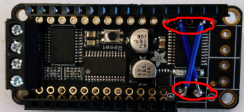
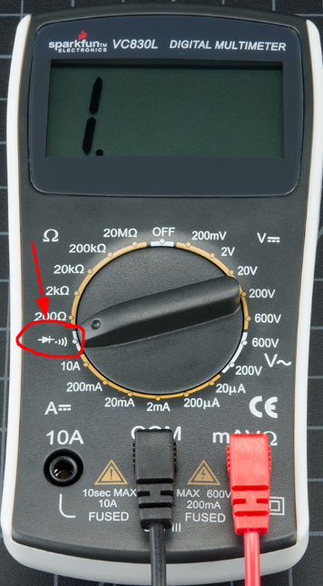
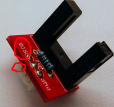
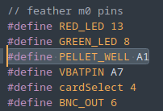

# Bateria

La revision de la bateria consiste en dejar el FED con su respectiva bateria corriendo el programa ~/fed_techical_check/scripts/testing/battery_test. Una vez cargado el programa debes dejar andando por 24 horas. El programa hace girar el disco del FED y toma muestras del nivel de bateria cada 1 segundo. Esto queda guardado en la microsd. Una vez terminadas las 24 horas debes ir a fed_techical_check/scripts/analysis y buscar el script fed_batt_analysis.R

## Testeando la capacidad de la bateria

1. Abre la tarjeta microsd en tu computador y entra al archivo config.txt y modifica el parametro randomFeed, para el testeo de bateria pon el numero '99' sin las comillas  y guarda el archivo

2. Carga el programa battery_test ocupando platformio, si estas desde la terminal ocupa el codigo 'pio run -d ~/fed_techical_check/scripts/testing/battery_test -t upload' asegurandone de tener el FED conectado y con la bateria

3. Espera 24 horas para desconectar la bateria y remover la tarjeta microsd

4. Realiza una copia del archivo [numero fed].CSV en tu escritorio

5. Abre el script fed_batt_analysis.R y sigue las instrucciones que hay dentro

### Si la bateria esta por debajo de la capacidad esperada

Marca la bateria indicando la fecha del test y el ultimo voltaje registrado.

### Battery is at or above expected capacity

Recarga la bateria para utilizarla posteriormente.

# Motor

La revision del motor consiste en dejar andado el motor durante 1 hora a una cantidad de pasos constante. El programa registra cuanto tiempo se demora cada vez que realiza esa cantidad de pesos (100) y el script de analisis genera un histograma para observar si hay desviaciones de lo esperado.

## Testeando la velocidad de rotacion del motor

1. Abre la tarjeta microsd en tu computador y entra al archivo config.txt y modifica el parametro randomFeed, para el testeo de bateria pon el numero '100' sin las comillas  y guarda el archivo

2. Carga el programa motor_test ocupando platformio, si estas desde la terminal ocupa el codigo 'pio run -d ~/fed_techical_check/scripts/testing/motor_test -t upload' asegurandone de tener el FED conectado y con la bateria

3. Espera 1 hora para desconectar la bateria y remover la tarjeta microsd

4. Realiza una copia del archivo [numero fed].CSV en tu escritorio

5. Abre el script fed_motor_analysis.R y sigue las instrucciones que hay dentro

### El motor gira mas lento o mas rapido de lo esperado

Si las desviaciones son significativas (arriba de 15% sobre o por debajo de la moda), el motor debe ser etiquetado con mal funcionamiento y reemplazado. Si el motor no gira ve a la seccion [conectividad del motor](#conectividad-motor).

### El motor gira a la velocidad adecuada

Limpia el motor ocupando un cepillo de diente asegurandote de remover la mayor cantidad de polvo o restos que tenga, recuerda realizar la limpieza del motor con el FED desconectado de la bateria.

## Revisando la conectividad del motor {#conectividad-motor}

Si estas aca es porque el motor probablemente no gira o bien presenta moviemiento significativamente alterado. Esto es probablemente por problemas de conectividad entre el punto de conexion de los cables y la tierra o pin de voltaje.

Indicado en rojo son los dos cables que hacen puente y presentan la mayor cantidad de problemas. Lo que tendras que realizar es una prueba con el multimetro para asegurar que la soldadura este bien puesta o bien reemplazarla.

El nombre tecnico para esto es probar la 'continuidad', para ello debes rotar la perilla del multimetro hasta el icono indicado en la imagen de abajo y colocar una punta de prueba en cada extremo del puente (no importa que color de punta de prueba ocupes para cada extremo, solo asegurate de probar el puente de manera cruzada). Si hay conectividad deberia sonar un pito.

### El multimetro no emite un pito

Si el multimetro no emite un pito, reemplaza el cable y vuelve a realizar la soldaduria del puente. Re-testea tu trabajo.

### El multimetro emite el pito

Esto probablemente indica que el motor esta malo y hay que descartarlo. Para asegurarte revisar que el motor no presente dano en sus cables y se encuentre correctamente conectado a las terminales.

# Sensor infrarrojo

El sensor infrarrojo es una de las piezas criticas del FED, ya que es la que determina si el pellet se entrego o no de forma exitosa. Para esto sin embargo solo se requiere de un programa 'sensor_test' que marca 0 cuando el sensor no esta detectando y 1 cuando si lo hace.

## Probando el area de deteccion

Para probar esto simplemente se debe armar el FED tal como si se fuese a ocupar en un experimento y tomar un pellet con una pinza y lanzarlo en el comedero 100 veces. Cada vez que el pellet se aloje en el comedero el sensor debe registrar 1.

1. Abrir y subir el programa 'sensor_test'
2. Abrir el monitor del Arduino IDE, en este punto NO usaremos platformio
3. Lanzar un pellet al comedero y observar si el monitor muestra '1'
4. Anotar y repetir 100 veces

### El area de deteccion del sensor es menos o distinto de lo esperado

1. Revisar el cable de senal, ir a [revisando cable de senal](#cable-senal)
2. Marcar y cambiar el sensor

### El sensor tiene el area de deteccion adecuada

Desconectar el sensor y utilizando una torula con etanol limpiar todos los puntos de conexion, esperar que el etanol se evapore y volver a conectar

## Revisando el cable de senal {#cable-senal}

El cable de senal es el encargado de entregar la senal digital al FED de si hay o no un pellet presente. En la imagen marcado con circulos rojos se indica donde deberia salir este cable. Para testear si se encuentra en buenas condiciones repite el procedimiento realiza el mismo procedimiento del multimetro [conectividad del motor](#conectividad-motor) entre el area superior marcada con el circulo rojo y el pin donde se encuentra soldado el cable.

### No hay senal digital presente

Si luego de haber realizado el testeo del area del sensor, y realizado el procedimiento con el multimetro (y soldado el area en caso de ser necesario) aun no se genera senal es posible que el pin del feather M0 o bien el motor shield este presentando problemas. Para revisar ese caso, prueba ese pin usando otro sensor. Si efectivamente el pin esta en malas condiciones, es necesario reemplazar el feather M0 o el motor shield. Si lo anterior no se encuentra dentro de las posibilidades puedes probar soldando el cable de senal a cualquier otro pin analogo y modificando el parametro de /src/headers.h

### La senal digital esta presente

# 3D parts integrity

## Comparing 3D parts against original STL file

### Parts are damaged or not similar to STL file

### Parts are as expected

See [Pellet delivery stress test](#Pelletdeliverystresstest)

# Pellet delivery stress test {#Pelletdeliverystresstest}

## Unloading full silo

### Unloading presents errors

### Unloading goes as expected

FED is succesfuly tested, and present no errors.

